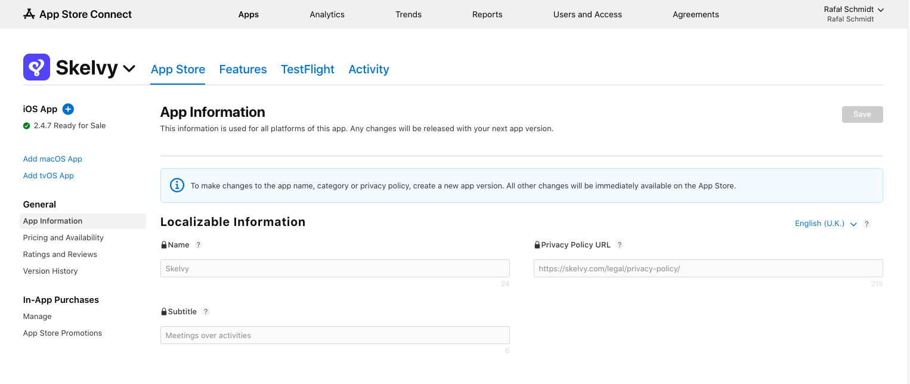
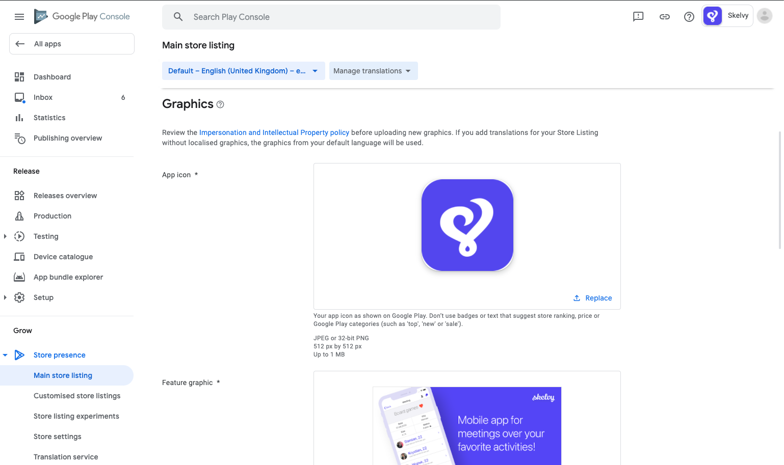
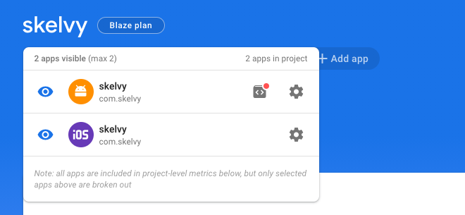
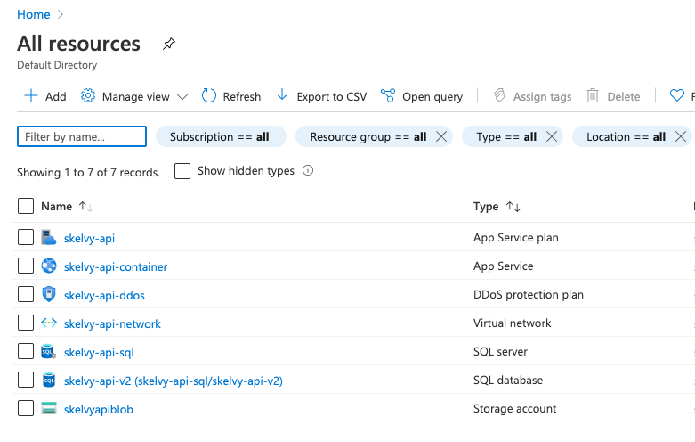
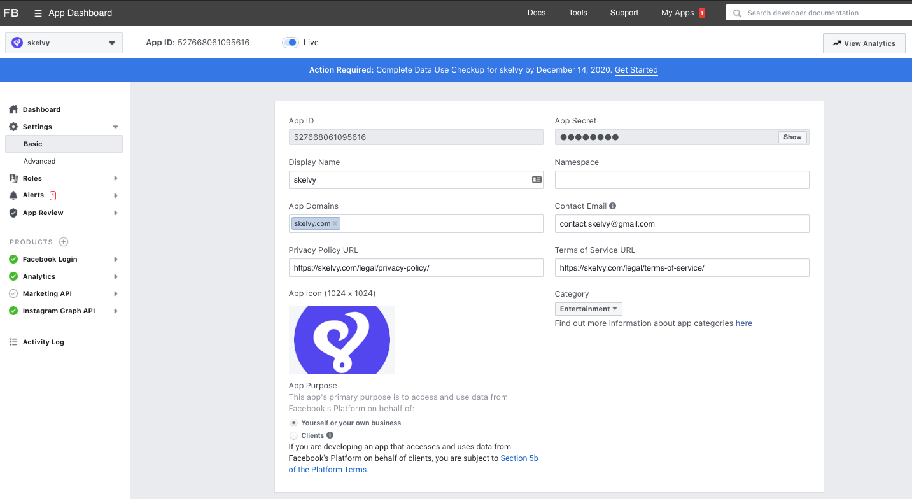
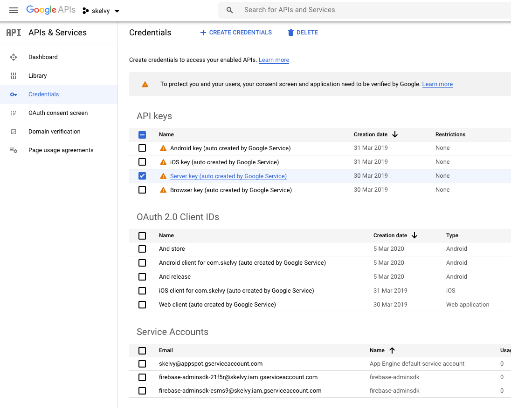

This repository is a part of **skelvy** project. It includes api for mobile app.
Created with dotnet core and aspnet. Crafted with love to new technologies! 

There are other parts of the system which are located within different repositories:
- [Mobile apps (Android and iOS) - Ionic 4 and Angular 8](https://github.com/rafalschmidt97/skelvy-client)
- [Website - Wordpress](https://github.com/rafalschmidt97/skelvy-website)
- [Utilities - additional tools, graphics](https://github.com/rafalschmidt97/skelvy-utilities)

## Idea

The idea for Skelvy is extremely simple as it a tool for arranging and finding meetings over favourite activities in the city. Users log in to the app, fill in the meeting parameters with when, where and what they are planning or simply would like to do. Meetings always might be open to the public so other people in the area would see them in their explore tab.

## Tech stack

C#, REST with ASP.NET Core 3.0 (the structure heavily inspired by jasontaylordev/NorthwindTraders - with CQS approach, FluentValidation and EF configs in external files), MSSQL (docker), Entity Framework, Dapper, Redis (docker) for cache and services backplane, Scheduling tasks with Coravel, OpenAPI with Swagger, Email Templates with Razor, Geolocation with Google Maps, Authorization with Facebook and Google (JWT), Websocket with SignalR for real time communication (chat + in app notifications), Firebase Messaging for Push Notifications, TDD, Xunit, Moq, Sqlite for testing, Logging with Serilog, Linting with StyleCop and FxCop, Azure Storage for uploading photos, CI with TravisCI, deploy as docker image to Azure App Service (with Azure MSSQL and Redis).

The app is translated into 9 languages:
- Polish
- English
- German
- Spanish
- French
- Italian
- Russian
- Finnish

## Database schema

## Video introduction

- [English Youtube Video](https://youtu.be/_uS4fBgzgC4)
- [Polish Youtube Video](https://youtu.be/kRucIyZtuGA)

## Deployment setup

- Buy AppStore license and configure the app within App Store Connect:
  - Fill basic app information (category, tags, keywords, description, version release setup)
  - Check pricing (Free?) and availability (it used to be configured for 38 of 175 countries and regions)
  - Setup testers and TestFlight, app revision information
  - Configure different localizations (currently English, Finnish, French, German, Italian, Polish, Russian and Spanish are supported)

- Similarly pay registration fee for Google Play and configure in similar manner:

- Create firebase app to configure push notifications. For Android you need to generate and fill SHA-1 certificate fingerprints.

- Prepare all necessary resources on azure:
  - App Service + App Service Plan
  - MSSQL Database
  - Redis (for caching google maps requests)
  - Blob Storage (+ add container) - for profile images
  - (Optional) DDOS Protection Plan + Virtual Network
 

- Create API Key for Google Maps (same dashboard as config for Google Plus)

- Configure authentication

Facebook Auth:

 

Google Plus Auth

 

\+ Apple Auth (required from the newest version) - not implemented yet.

## Contributing guidelines

We really hope that good instructions for contributing will make the history of our app more readable. 
Take a look [here](CONTRIBUTING.md).

## Development

Current state of development is available to see on [trello](https://trello.com/b/MCzNyRJf).

## Stay in touch

* Website - [skelvy.com](https://skelvy.com/)
* Facebook - [skelvyapp](https://facebook.com/skelvyapp/)
* Twitter - [skelvyapp](https://twitter.com/skelvyapp/)
* Instagram - [skelvyapp](https://instagram.com/skelvyapp/)
* Email - [contact.skelvy@gmail.com](mailto:contact.skelvy@gmail.com)
